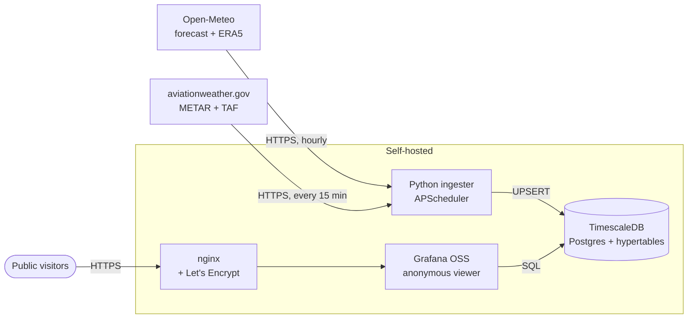
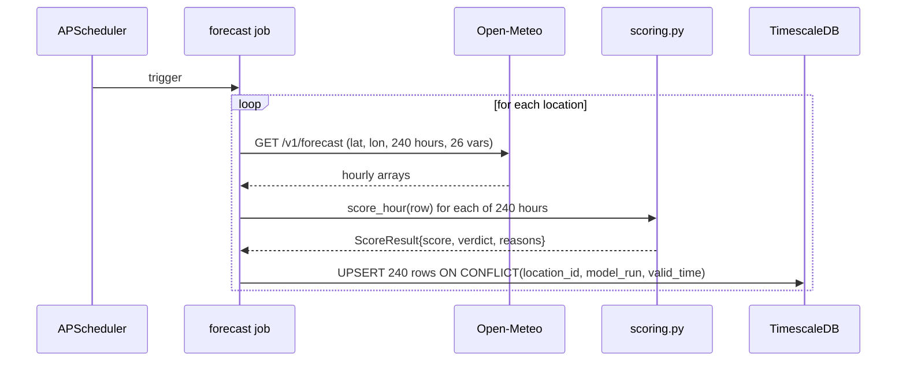
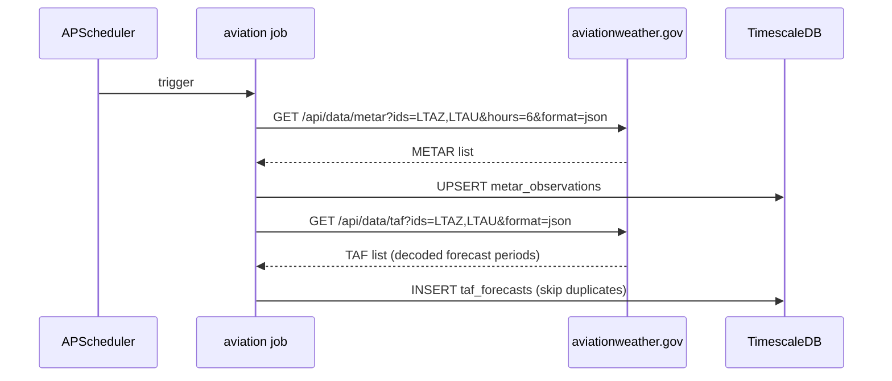

# Architecture

This document describes how the Cappadocia balloon flight conditions system is put together — the components, the data flow, the scoring logic, and the deployment topology. Read this if you want to understand the system before changing it.

## High level



There are three logical halves:

1. **Pull data in** — the ingester runs on a schedule, fetches from open public APIs, scores it, and writes to the database.
2. **Store as time series** — TimescaleDB hypertables hold forecasts (10 days forward, ~90 days back), live observations, and TAFs.
3. **Render a story** — Grafana queries the database and renders the dashboard. Anonymous viewers see it directly.

## Components

### Ingester (`ingester/`)

Single Python service. Boots, runs an immediate forecast pull, kicks off the historical backfill if needed, then enters APScheduler with two recurring jobs.

- `main.py` — entry point. Schedules forecast (60 min) and aviation (15 min) jobs. On startup runs each once.
- `config.py` — environment-driven settings.
- `db.py` — psycopg connection pool + helpers.
- `scoring.py` — pure-Python flight-likelihood scoring. No I/O. Documented thresholds. Unit tested.
- `sources/open_meteo.py` — forecast and ERA5 historical fetchers; normalises to row dicts ready for upsert.
- `sources/aviationweather.py` — METAR + TAF fetchers; parses NOAA's JSON shape.
- `tests/` — unit tests for scoring (no DB needed).

Each fetcher returns a list of dicts matching the database schema. The main loop upserts via `ON CONFLICT … DO UPDATE`, so re-running is idempotent.

### Database (`db/`)

- `migrations/001_init.sql` — schema. Three TimescaleDB hypertables (`forecast_hourly`, `metar_observations`, `taf_forecasts`), plus a regular `locations` reference table and a `v_sunrise_window` view that aggregates per-day flight scores in the 04–07 Istanbul launch window.
- `migrations/002_seed_locations.sql` — seeds the 6 launch sites and 2 reference airports.

Postgres `docker-entrypoint-initdb.d` runs both migrations on first DB initialisation only. They're idempotent (`CREATE TABLE IF NOT EXISTS`, `ON CONFLICT DO UPDATE`), so re-running them by hand is safe.

Retention policies (per migration 001) keep raw forecasts for 395 days, METAR for 180 days, TAF for 90 days.

### Grafana (`grafana/`)

- `provisioning/datasources/timescale.yml` — pins the data source UID to `Balloon-DB` so dashboard JSON references resolve deterministically. Includes `deleteDatasources:` to wipe stale auto-UID datasources on first reload.
- `provisioning/dashboards/dashboards.yml` — points Grafana at the file-based dashboards folder. `allowUiUpdates: true` lets admins edit live without losing changes on restart.
- `dashboards/cappadocia-flight-conditions.json` — the dashboard itself. Reads-only public, story-flow layout (verdict → satellite + Windy → hourly breakdown → 10-day strip → atmosphere → history → help).

### Reverse proxy (`nginx/`)

- `nginx.conf` — terminates HTTPS, proxies `/` to Grafana on the compose network, serves the ACME challenge for Let's Encrypt.

## Data flow

### Forecast cycle (every 60 minutes)



`model_run` is the current hour's UTC timestamp. Re-running the job within the same hour is a no-op upsert.

### Aviation cycle (every 15 minutes)



### Historical backfill (one-shot on startup)

If `forecast_hourly` has fewer than ~80% of the expected ERA5 rows for a location, the ingester runs once at boot to backfill the last `HISTORICAL_LOOKBACK_DAYS` (default 90) of ERA5 reanalysis from Open-Meteo's archive API. This populates the historical 90-day GO rate panel and lets you study seasonal patterns.

## Scoring logic

Pure function: 1 hour of weather → `(score, verdict, reasons)`. Located in `ingester/scoring.py`, fully covered by unit tests in `ingester/tests/test_scoring.py`.

The score starts at 100 and deducts penalties for each adverse factor. Three verdicts:

| Verdict | Score | Friendly label |
|---|---|---|
| GO | ≥ 70, no hard fail | HIGH CHANCE |
| MARGINAL | 40–69 | MAYBE |
| NO_GO | < 40 or any single hard-fail trigger | NO CHANCE |

Hard-fail triggers (any one drops verdict to NO_GO regardless of numeric score):

- Surface wind ≥ 18 km/h
- Wind gusts ≥ 25 km/h
- Visibility < 3 km
- Precipitation ≥ 0.5 mm/h
- CAPE ≥ 500 J/kg
- Lifted Index ≤ −2

The full threshold table is in [docs/data-sources.md](docs/data-sources.md#scoring-thresholds).

The score is calculated at ingest time and stored in `forecast_hourly.flight_score`. This means the dashboard never has to compute it at query time — it only filters and aggregates.

## Deployment topology

Everything runs in one Docker Compose stack on a single VM (DigitalOcean droplet, 2 GB RAM minimum). Services share a private compose network; only nginx exposes port 80/443 to the public internet. Postgres and Grafana are not directly reachable from outside — Grafana's host port is bound to `127.0.0.1` only.

```
Public internet
    │
    ▼
nginx (443)
    │
    ▼
Grafana (3000, internal)
    │
    ▼  (SQL via private compose network)
TimescaleDB (5432, internal)
    ▲
    │  (UPSERT from background jobs)
    │
Ingester (no exposed port)
```

Three named volumes persist state:
- `db_data` — Postgres data directory
- `grafana_data` — Grafana's internal SQLite (users, sessions, edited dashboards)
- `certbot_certs` and `certbot_www` — Let's Encrypt certs and ACME challenges

## Why these choices

**TimescaleDB over InfluxDB.** TimescaleDB is Postgres with hypertables — full SQL support, joins between forecast and observation tables, easy to query from Grafana with the official Postgres data source. InfluxDB Flux/InfluxQL adds friction for the kind of joins this dashboard does.

**Open-Meteo over OpenWeatherMap.** Free, no API key, generous rate limits, and gives us wind at four altitudes (10 / 80 / 120 / 180 m) in the same call — critical for the wind-shear logic that pilots use to steer.

**aviationweather.gov over MGM.** The Turkish state met service (MGM) doesn't expose a stable public API. aviationweather.gov mirrors global METAR/TAF feeds for free and returns clean JSON.

**Score at ingest, not query.** Pre-computing flight_score lets the dashboard stay snappy and lets us back-fill the score on historical data using exactly the same Python function — no SQL/Python parity bugs.

**Anonymous Grafana over building a custom frontend.** Grafana is the right tool for this. Building a bespoke React app would be 10× the code and not visibly better for users.

**Single VM Docker Compose over Kubernetes.** This is one read-mostly workload with three data sources. Compose is right-sized; k8s would be ceremony.

## What this system does NOT model

These are deliberate omissions, all documented to set realistic expectations:

- **SHGM authorisation.** The actual go/no-go each morning is made by Turkey's Civil Aviation around 04:00–05:00 local. We can't predict that — but our weather-based likelihood maps onto it well in practice.
- **Operator-level decisions.** Crew rest, fuel reserves, slot allocation, retrieval logistics — these aren't in any public feed.
- **Landing site availability.** Wet fields, livestock, recently planted crops — not modelled.
- **Air-traffic slots.** SHGM coordinates ~150 daily slots in peak season; that data isn't public.

A `HIGH CHANCE` verdict on this dashboard means *the weather looks favourable*, not *flights are confirmed*. Most cancellations happen due to weather, so this is still a strong signal — but it's advisory, not authoritative.

## Extending the system

If you want to add a new feature, here's where things go:

| Change | Where |
|---|---|
| New weather variable from Open-Meteo | Add to `HOURLY_VARS` in `ingester/sources/open_meteo.py`; add a column to `forecast_hourly`; update scoring or add a new panel. |
| New data source (e.g. EUMETSAT satellite fog) | New module under `ingester/sources/`; new table or columns; new fetcher job in `main.py`. |
| New launch site | Add a row to `db/migrations/002_seed_locations.sql` and re-run the migration (or insert via SQL). |
| New panel | Edit `grafana/dashboards/cappadocia-flight-conditions.json` directly, or via Grafana UI then export. |
| New scoring threshold | Edit `ingester/scoring.py` and add a unit test in `ingester/tests/test_scoring.py`. |

For larger changes (e.g. switching to k8s, splitting the ingester per source) discuss in an issue first.
